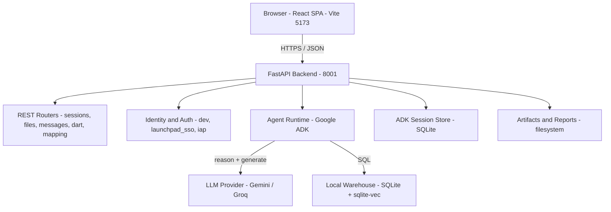
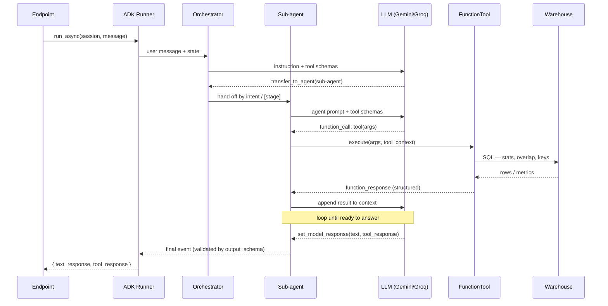

# DataMap (STTM) — Source-to-Target Mapping

DataMap is an **AI-assisted data profiling, mapping, and extraction workbench**. You
upload source data files (CSV / Excel); DataMap loads them into a local analytical
warehouse and runs a sequence of AI agents to **profile**, **relate**, **document**,
**check for anomalies**, and **map** the data to target templates.

It runs **fully standalone** — no external services and no login. All you provide is
one LLM API key (Google Gemini or Groq).

---

## What it does

- **Automated data profiling** — row/column stats, data-quality scoring, and a full HTML profiling report.
- **Relationship analysis** — detects primary/foreign keys and cross-table relationships.
- **Data dictionary generation** — column-level definitions, types, and keys.
- **Anomaly analysis** — flags column/table anomalies with severity scoring.
- **Reference matching** — similarity checks and reference-table suggestions (vector search).
- **Metadata templates** — fills column and file-spec templates for mapping.
- **Conversational assistant** — ask questions about your profiled data from the Chat panel.
- **In-app documentation** — full technical docs at `/documentation` (Sidebar → Documentation).

---

## Architecture

Two tiers: a **React single-page app** talks to a **FastAPI backend** that hosts the
REST API, the AI agents (Google ADK), and a local SQLite warehouse. The backend calls
an LLM provider (Gemini by default, or Groq via LiteLLM). Everything runs locally —
nothing leaves your machine except the LLM calls.



**Module layers (backend):** `API` (`api/main.py`, `api/routers/*`, `api/dependencies/auth.py`)
→ `Agent Runtime` (ADK `Runner`, orchestrator + sub-agents, the `config/settings.py`
standalone patches) → `Domain Logic` (`utils/profiling_dispatcher.py`,
`relationship_functions.py`, `data_anomaly_functions.py`, …) → `Persistence`
(`local_warehouse.py`, `DatabaseSessionService`, `db/`).

---

## How it works

### The profiling pipeline

After a session is created and files are uploaded + processed, the UI walks through an
8-step pipeline. Steps 1–7 are AI-driven; the warehouse load and HTML report come from
processing.

| # | Step | What it does | Endpoint |
|---|------|--------------|----------|
| 1 | Dataset Overview | Profiling report, counts, data-quality score, AI summary | `POST /messages/send` |
| 2 | Relationship Analysis | PK/FK + cross-table relationships | `POST /messages/send` |
| 3 | Data Dictionary | Column-level dictionary, saved as a table | `POST /messages/data-dictionary` |
| 4 | Similarity Check | Compares columns vs reference tables | `POST /messages/similarity-check` |
| 5 | Reference Suggestion | Reference-table suggestions (vector search) | `POST /dart/dart-suggestion` |
| 6 | Data Anomaly Analysis | Anomalies with severity scoring | `POST /messages/send` |
| 7 | Metadata Template | Fills metadata + file-specs template | `POST /messages/metadata_fill` |
| 8 | Detailed Profiling | Full ydata-profiling HTML report | `GET /reports/{id}.html` |

### The agents (how the AI part works)

Each step spins up an ADK `Runner` that drives an **Orchestrator agent** (`root_agent`).
It reads the user's intent and the bracketed `[stage]` and **delegates** to a specialized
sub-agent via `transfer_to_agent`. Each sub-agent owns a few **FunctionTools** and a strict
**`output_schema`**.

An agent is an LLM in a **reason → act → observe** loop: it emits a `function_call`, ADK
runs the matching tool (which queries the warehouse), feeds the result back, and the loop
repeats until the agent calls `set_model_response(text_response, tool_response)` — validated
against its `output_schema` and written to session state.



| Agent | ADK type | Tools | Output schema |
|-------|----------|-------|---------------|
| `root_agent` | LlmAgent | routing + `ground_truth_tool` | — (router) |
| `profiling_agent` | Agent | `intelligent_profiling_tool`, `relationship_analysis_tool` | `OutputFormatProfiling` |
| `profiling_agent_anomaly` | Agent | `data_anomaly_analysis_tool` | `OutputFormatAnomaly` |
| `data_dict_agent` | LoopAgent | `append_chunk_to_bq`, `signal_exit` | `DataDictionaryResponse` |
| `smart_similarity_agent` | SequentialAgent | `fetch_metadata_tool` | `SemanticMatchingResponse` |
| `dart_suggestion_agent` | LlmAgent | `dart_suggestions_tool` | `DartSuggestionResponse` |
| `metadata_fill_agent` | LlmAgent (PlanReAct) | `bigquery_toolset` | `MetadataFillHITLResponse` |

---

## Tech stack

| Layer | Technology |
|-------|------------|
| Frontend | React 19, TypeScript, Vite, Tailwind CSS, Redux Toolkit, react-markdown, Mermaid |
| Backend | Python 3.12, FastAPI, Uvicorn, Pydantic v2 |
| AI / agents | Google ADK, google-genai, LiteLLM |
| LLM | Gemini Developer API (default) or Groq |
| Storage | SQLite warehouse + sqlite-vec, ADK `DatabaseSessionService`, local artifacts/reports |
| Profiling | pandas, NumPy, ydata-profiling |

---

## Quick start

**Prerequisites:** Python 3.12 · Node.js 18+ and npm · a bash shell (macOS/Linux; on
Windows use WSL) · an LLM API key (free Gemini key at <https://aistudio.google.com/apikey>,
or a Groq key).

```bash
# 1. Clone
git clone https://github.com/Aasrith-Mandava/STTM.git
cd STTM

# 2. Create the backend env file from the template
cp datamap_backend/.env.example datamap_backend/.env

# 3. Add your key to datamap_backend/.env
#    GOOGLE_API_KEY=your-key-here
#    (or use Groq:  LLM_PROVIDER=groq  +  GROQ_API_KEY=your-groq-key)

# 4. Start backend (:8001) + frontend (:5173) — installs deps on first run
./start.sh
```

Then open <http://localhost:5173>. Override ports with `BACKEND_PORT` / `FRONTEND_PORT`.
Stop both with **Ctrl+C**.

> No data handy? Use the bundled sample CSVs in [`sample_data/`](sample_data/), or download
> them in-app from the Documentation page. On the upload page, drop all the CSVs into the main
> **Source data** field — the **Data Dictionary** and **BRD** fields are optional. See
> [`sample_data/README.md`](sample_data/README.md) for the file-to-field guide.

---

## What to upload (by workflow)

Different workflows expect different inputs — upload each file into its matching field.

**Profiling** — *New Profiling → Upload*

| Field | Required? | Accepts | What to upload |
|-------|-----------|---------|----------------|
| **Source data** (main drag-and-drop) | Required | CSV | The data tables to profile (e.g. `providers.csv`, `members.csv`). Upload all together. |
| **Data Dictionary** | Optional | CSV, XLSX, TXT | A column dictionary, if you have one |
| **BRD Document** | Optional | PDF, DOCX | A business-requirements doc, if you have one |

**Extract** — *New Session → Extract*

| Field | Required? | Accepts | What to upload |
|-------|-----------|---------|----------------|
| **BRD Document** | Required | PDF, DOCX | The Business Requirements Document |
| **File Layout Document** | Required | PDF, DOCX, XLSX | The source file layout / spec |
| **Transcript** | Optional | PDF, DOCX | A meeting / call transcript, if you have one |

> Sample data is for the **Profiling** workflow: drop all four CSVs (`groups`, `providers`,
> `members`, `medical_claims`) into **Source data**; leave Data Dictionary / BRD empty.

## Configuration

Backend config lives in `datamap_backend/.env` (git-ignored — secrets never committed).

| Variable | Default | Purpose |
|----------|---------|---------|
| `LLM_PROVIDER` | auto (`gemini`) | `gemini` or `groq` |
| `GOOGLE_API_KEY` | — | Gemini Developer API key |
| `GROQ_API_KEY` | — | Groq key (with `LLM_PROVIDER=groq`) |
| `GOOGLE_GENAI_USE_VERTEXAI` | `FALSE` | Keep `FALSE` for standalone |
| `APP_SESSION_AUTH_MODE` | `dev` | `dev` (no login), `launchpad_sso`, or `iap` |
| `DATAMAP_CORS_ORIGINS` | local origins | Comma-separated CORS allow-list override |

---

## Project structure

```
STTM/
├── datamap_frontend/        React + Vite SPA
│   └── src/{pages,components,end-points,state,hooks,config,utils}
├── datamap_backend/         FastAPI + Google ADK
│   ├── api/{main.py,routers,dependencies,models.py}
│   ├── agents/              ADK orchestrator + sub-agents
│   ├── utils/               tools, warehouse, ADK runtime, LLM helpers
│   ├── db/                  app session DB (SQLite)
│   ├── config/settings.py   config + standalone patches
│   └── data/                runtime: warehouse.db, sessions, artifacts (git-ignored)
├── sample_data/             example CSVs for testing
└── start.sh                 one-command local launcher
```

### Local storage (all SQLite + files, created on first run)

| Store | Path | Holds |
|-------|------|-------|
| Analytical warehouse | `data/warehouse.db` | Uploaded tables, queried with SQL |
| Vector store | `data/vectors.db` | Embeddings for similarity / reference search |
| ADK sessions | `data/adk_sessions.db` | Agent conversation history + state |
| App DB | `data/app.db` | Session metadata |
| Artifacts / Reports | `data/artifacts/`, `reports/` | Raw files, step responses, HTML reports |

---

## Troubleshooting

| Symptom | Fix |
|---------|-----|
| "Network Error" on every call | Run the frontend on `5173`, or set `DATAMAP_CORS_ORIGINS` |
| "Something went wrong, Try again" | Transient LLM hiccup — click **Retry** |
| AI steps error with no output | Add a valid key to `.env` and restart |
| Port already in use | Change `BACKEND_PORT` / `FRONTEND_PORT` |
| Similarity / Reference "no results" | Expected in standalone (no reference dataset) |

The interactive API spec is available at `/docs` (Swagger) and `/openapi.json`. Full
technical documentation is built into the app at **`/documentation`**.
